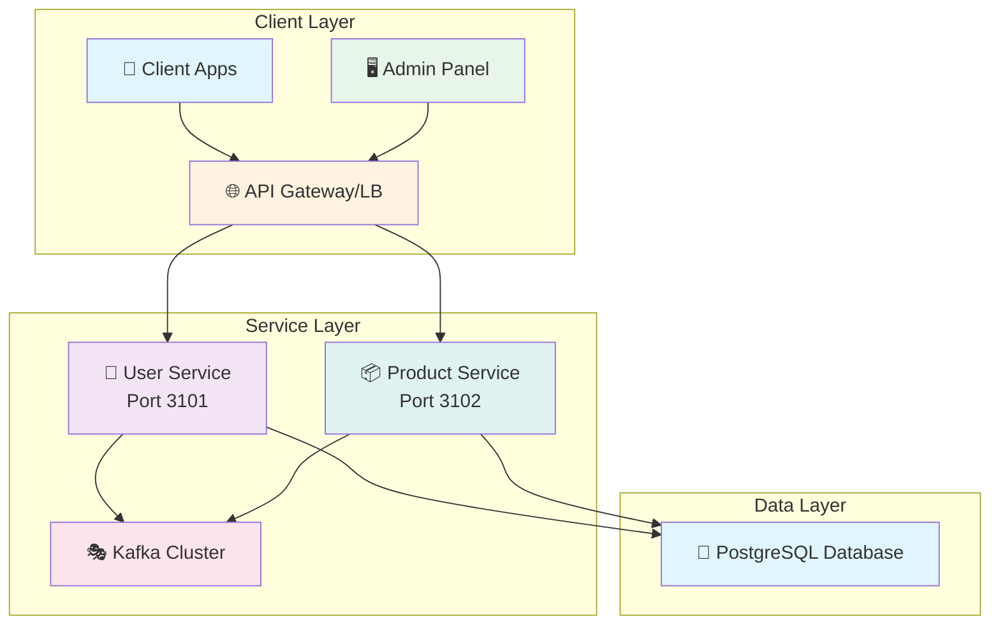
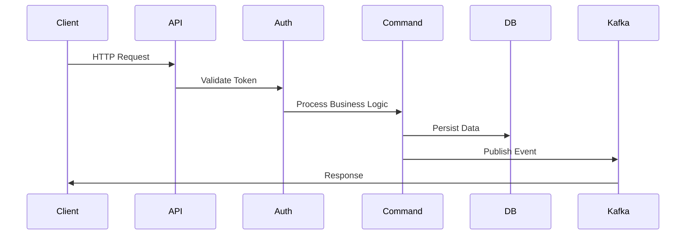
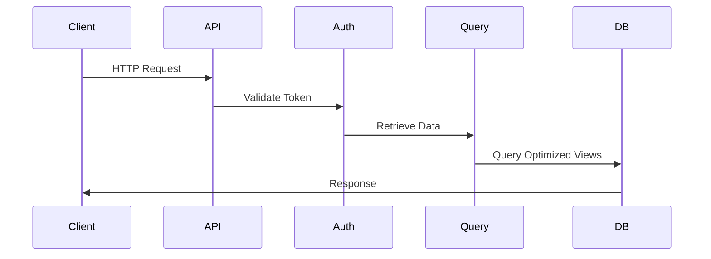
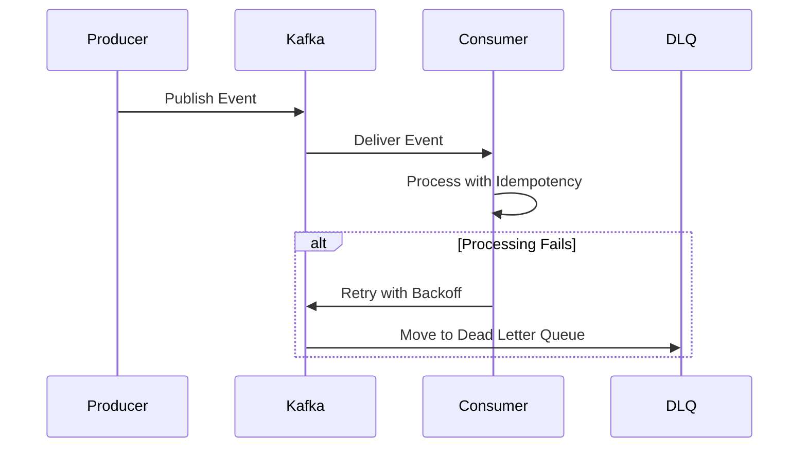
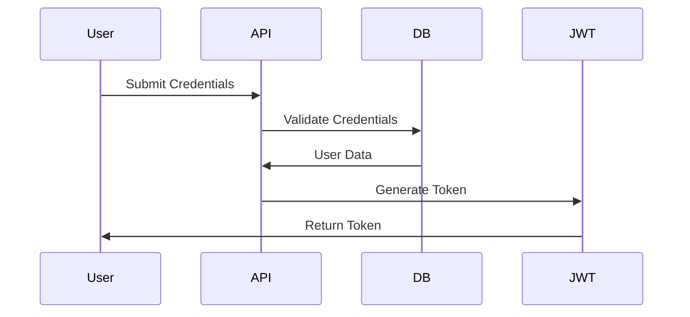

# 🚀 Bun + Hono + Kafka Microservices (Simple CQRS Boilerplate)

## 📋 Executive Summary

This is a simplified microservices boilerplate using modern technologies optimized for performance and ease of use. The implementation showcases the CQRS (Command Query Responsibility Segregation) pattern with event-driven communication through Kafka, providing a clean foundation for building distributed systems without unnecessary complexity.

## 🛠️ Technology Stack

### ⚡ Runtime & Web Framework

- **🥤 Bun**: Ultra-fast JavaScript runtime with built-in bundler, test runner, and package manager
- **🔥 Hono**: Lightweight, fast web framework with TypeScript-first approach and middleware support

### 🏗️ Architecture Patterns

- **🔄 CQRS**: Separation of command (write) and query (read) operations for optimized data handling
- **📡 Event-Driven Architecture**: Asynchronous communication via Kafka events
- **🎯 Domain-Driven Design (DDD)**: Clear bounded contexts with user and product services
- **💉 Dependency Injection**: TypeDI with reflect-metadata for clean service composition

### 🗄️ Data Layer

- **🐘 PostgreSQL**: Primary data store with ACID compliance and advanced JSON support
- **🔮 Drizzle ORM**: Type-safe database access with migrations and query optimization
- **🔗 Connection Pooling**: Configurable pool settings for optimal performance

### 📨 Messaging Infrastructure

- **🎭 Apache Kafka**: Distributed streaming platform with 2-broker cluster (KRaft mode)
- **📜 KafkaJS**: Modern Node.js client with producer/consumer abstractions
- **🛡️ Reliability Patterns**: Batching, retries with exponential backoff, and Dead Letter Queues (DLQ)

### 🔐 Security & Authentication

- **🎫 JWT (JSON Web Tokens)**: Stateless authentication with configurable expiration
- **👥 RBAC (Role-Based Access Control)**: ADMIN and USER roles with endpoint protection
- **🔑 Password Hashing**: bcrypt for secure password storage

### 💻 Development Experience

- **📘 TypeScript**: End-to-end type safety with strict configuration
- **⚡ Hot Reload**: Instant feedback during development
- **📝 Structured Logging**: Pino logger with JSON output for production monitoring
- **⚙️ Environment Management**: Comprehensive .env configuration

## 🏛️ System Architecture

### High-Level Overview



### 🎯 Service Boundaries

#### 👤 User Service (Port 3101)

- **🎯 Responsibility**: User management, authentication, and authorization
- **🔒 Access Control**: ADMIN role for user management operations
- **✨ Key Features**:
  - User registration and management
  - JWT token generation and validation
  - Role-based access control
  - User event publishing to Kafka

#### 📦 Product Service (Port 3102)

- **🎯 Responsibility**: Product catalog management and operations
- **🔒 Access Control**: USER role for product CRUD operations
- **✨ Key Features**:
  - Product creation, retrieval, update, and deletion
  - Owner-based access control
  - Product event publishing to Kafka
  - Cross-service communication via events

### 🔄 Data Flow Patterns

#### ✍️ Command Flow (Write Operations)



#### 👁️ Query Flow (Read Operations)



#### 📡 Event Flow (Async Communication)



## 📁 Project Structure

```
bun-hono-kafka-cqrs/
├── apps/                          # Microservice applications
│   ├── user-service/              # User management service
│   │   ├── src/
│   │   │   ├── app.ts            # Hono application bootstrap
│   │   │   ├── routes/           # HTTP route definitions
│   │   │   │   ├── auth.ts       # Authentication endpoints
│   │   │   │   └── admin.ts      # Admin-only endpoints
│   │   │   ├── commands/         # Command handlers (write operations)
│   │   │   ├── queries/          # Query handlers (read operations)
│   │   │   ├── services/         # Business logic services
│   │   │   ├── repositories/     # Data access layer
│   │   │   ├── dto/              # Data Transfer Objects
│   │   │   ├── events/           # Event producers
│   │   │   └── consumers/        # Event consumers
│   │   ├── package.json
│   │   ├── tsconfig.json
│   │   └── bunfig.toml
│   └── product-service/          # Product management service
│       ├── [Similar structure as user-service]
│       ├── src/
│       │   ├── app.ts
│       │   ├── routes/
│       │   │   ├── auth.ts
│       │   │   └── products.ts
│       │   ├── commands/
│       │   ├── queries/
│       │   ├── services/
│       │   ├── repositories/
│       │   ├── dto/
│       │   ├── events/
│       │   └── consumers/
│       ├── package.json
│       ├── tsconfig.json
│       └── bunfig.toml
├── packages/                      # Shared packages
│   ├── common/                    # Common utilities and types
│   │   ├── src/
│   │   │   ├── auth.ts           # JWT middleware and helpers
│   │   │   ├── db.ts             # Database client singleton
│   │   │   ├── kafka.ts          # Kafka client factory
│   │   │   ├── logger.ts         # Pino logger configuration
│   │   │   ├── validation.ts     # Zod schemas
│   │   │   ├── di.ts             # Dependency injection setup
│   │   │   ├── types.ts          # Shared TypeScript types
│   │   │   ├── config/           # Configuration utilities
│   │   │   │   ├── loader.ts
│   │   │   │   ├── validator.ts
│   │   │   │   └── types.ts
│   │   │   └── index.ts
│   │   ├── package.json
│   │   └── tsconfig.json
│   └── drizzle/                    # Database schema and migrations
│       ├── src/
│       │   ├── schema/           # Drizzle schema definitions
│       │   ├── migrations/        # Database migration files
│       │   ├── repositories/      # Base repository classes
│       │   └── db/              # Database connection management
│       ├── drizzle.config.ts       # Drizzle configuration
│       ├── package.json
│       └── tsconfig.json
├── infra/                         # Infrastructure configuration
│   ├── docker/
│   │   ├── compose/
│   │   │   ├── dev.yml
│   │   │   ├── staging.yml
│   │   │   └── prod.yml
│   │   └── k8s/
│   │       ├── base/
│   │       ├── dev/
│   │       ├── staging/
│   │       └── prod/
│   └── kafka/
│       └── docker-compose.yml    # Kafka cluster configuration
├── scripts/                       # Automation scripts
│   ├── build.sh
│   ├── deploy.sh
│   ├── migrate.sh
│   └── test.sh
├── .github/                       # GitHub Actions workflows
│   └── workflows/
│       ├── ci.yml
│       ├── deploy-staging.yml
│       └── deploy-prod.yml
├── config/                        # Global configurations
│   ├── base.json           # Base configuration shared across environments
│   ├── dev.json            # Development-specific overrides
│   ├── staging.json         # Staging-specific overrides
│   └── prod.json            # Production-specific overrides
├── .env.example                   # Environment variables template
├── .env.dev                      # Development environment variables
├── .env.staging                  # Staging environment variables
├── .env.prod                     # Production environment variables
├── bun.lockb                     # Bun lock file
├── package.json                   # Root package configuration
├── tsconfig.json                  # TypeScript configuration
├── 00_README.md                  # This file
├── 01_BACKEND_CQRS.md            # Backend implementation guide
├── 02_KAFKA_SERVICES.md          # Kafka services guide
└── 03_IMPLEMENTATION_PLAN.md        # Multi-environment implementation plan
```

## 🎯 Key Architectural Decisions

### 🔄 CQRS Implementation Rationale

The CQRS pattern provides several benefits for this microservices architecture:

1. **📈 Scalability**: Read and write operations can be optimized independently
2. **⚡ Performance**: Query models can be denormalized for faster reads
3. **🔧 Flexibility**: Different data storage strategies for commands and queries
4. **🎯 Separation of Concerns**: Clear distinction between business operations and data retrieval

### 📡 Event-Driven Communication Benefits

1. **🔗 Decoupling**: Services communicate through events without direct dependencies
2. **🛡️ Resilience**: Asynchronous processing prevents cascading failures
3. **📈 Scalability**: Event consumers can scale independently
4. **📊 Auditability**: All state changes are recorded as events
5. **🔧 Flexibility**: New consumers can be added without modifying producers

### 🛠️ Technology Selection Justification

#### 🥤 Bun over Node.js

- 3x faster startup time
- 20-30% faster request processing
- Built-in bundler and test runner
- Native TypeScript support
- Reduced dependency footprint

#### 🔥 Hono over Express

- Better TypeScript integration
- Faster routing and middleware execution
- Modern API design with async/await support
- Smaller bundle size
- Built-in validation capabilities

#### 🔮 Drizzle over TypeORM

- Type-safe database access
- Better migration management
- Improved query performance
- Excellent developer experience
- Built-in connection pooling

#### 🎭 Kafka over RabbitMQ

- Higher throughput and scalability
- Better durability guarantees
- Native support for event sourcing
- Superior replay capabilities
- Better ecosystem for microservices

## ⚡ Performance Considerations

### 🗄️ Database Optimization

- Connection pooling with configurable limits
- Query optimization through Drizzle's query engine
- Proper indexing strategies for frequently accessed data
- Read replica support for query-heavy operations

### 🎭 Kafka Optimization

- Batch message processing for improved throughput
- Compression for reduced network overhead
- Partitioning strategies for parallel processing
- Consumer group management for load distribution
- Producer idempotency for exactly-once semantics

### 🚀 Application Performance

- Lazy loading of dependencies
- Efficient middleware ordering
- Response caching where appropriate
- Memory-efficient event processing

## 🔐 Security Implementation

### 🔑 Authentication Flow



### 🛡️ Authorization Implementation

- JWT middleware extracts and validates tokens
- Role-based middleware protects sensitive endpoints
- Resource ownership validation for user data
- Principle of least privilege enforced

### 🔒 Data Protection

- Password hashing with bcrypt
- Environment variable encryption for secrets
- HTTPS enforcement in production
- Input validation and sanitization

## 📊 Monitoring and Observability

### 📝 Logging Strategy

- Structured JSON logging with Pino
- Correlation IDs for request tracing
- Log levels for different environments
- Centralized log aggregation ready

### 💚 Health Checks

- `/health` endpoint for service availability
- Database connectivity verification
- Kafka cluster connectivity status
- Graceful degradation handling

### 📈 Metrics Collection

- Request/response timing
- Error rates and types
- Kafka message processing metrics
- Database query performance

## 🔄 Development Workflow

### 💻 Local Development Setup

1. Clone repository and install dependencies
2. Configure environment variables
3. Start Kafka cluster with Docker Compose
4. Initialize database with migrations and seed data
5. Run services in development mode with hot reload

### 🧪 Testing Strategy

- Unit tests for business logic
- Integration tests for API endpoints
- Contract tests for Kafka events
- End-to-end tests for critical user flows

### 🚀 Deployment Considerations

- Containerized services with Docker
- Environment-specific configurations
- Database migration automation
- Rolling deployment strategies
- Health check integration

## 🚀 Quick Start Guide

### 📋 Prerequisites

- 🥤 Bun 1.1.0 or later
- 🐳 Docker and Docker Compose
- 🐘 PostgreSQL 14 or later

### ⚙️ Setup Commands

```bash
# Clone repository
git clone https://github.com/your-org/bun-hono-kafka-cqrs.git
cd bun-hono-kafka-cqrs

# Install dependencies
bun install

# Setup git hooks for code formatting
bun run setup:hooks

# Start Kafka cluster
docker compose -f infra/kafka/docker-compose.yml up -d

# Run database migrations
bun run db:migrate

# Seed database (optional)
bun run db:seed

# Start services in development mode
bun run dev
```

### 🌐 API Endpoints

#### 👤 User Service (Port 3101)

- `POST /auth/login` - User authentication
- `POST /auth/admin/users` - Create user (ADMIN only)
- `GET /auth/me` - Get current user info
- `GET /auth/health` - Health check

#### 📦 Product Service (Port 3102)

- `POST /products` - Create product
- `GET /products` - Get user's products
- `PATCH /products/:id` - Update product (owner only)
- `DELETE /products/:id` - Delete product (owner only)
- `GET /products/health` - Health check

## 🌍 Environment Configuration

### 🛠️ Development Environment

- Local development with hot reload
- Verbose logging
- Mock external services when needed
- Small resource allocation

### 🧪 Staging Environment

- Production-like environment for testing
- Real external service integrations
- Production data subset (anonymized)
- Medium resource allocation
- Full monitoring stack

### 🚀 Production Environment

- Live environment for end users
- Optimized for performance and security
- Full resource allocation
- Comprehensive monitoring and alerting
- Strict access controls

## 🌐 Multi-Environment Support

This boilerplate includes comprehensive support for development, staging, and production environments with:

- Environment-specific configuration files
- Separate Docker Compose configurations
- CI/CD pipeline with GitHub Actions
- Environment-specific secrets management
- Database migration strategies
- Kafka topic management
- Monitoring and observability per environment

## 🎨 Code Style

This project uses Prettier to maintain consistent code formatting across all files. Please refer to the [Code Style Guide](docs/CODE_STYLE.md) for detailed information on:

- Formatting rules and configuration
- Setup instructions for your editor
- Usage of formatting scripts
- File exclusions and troubleshooting

## 🤝 Contributing

1. Fork the repository
2. Create a feature branch
3. Make your changes
4. Format your code using `bun run format`
5. Submit a pull request
6. Follow coding standards and practices

## 📜 License

MIT License - feel free to use this boilerplate for your projects!

---

This simplified boilerplate provides a clean foundation for building microservices with modern JavaScript/TypeScript technologies, emphasizing simplicity and essential functionality without unnecessary complexity.
